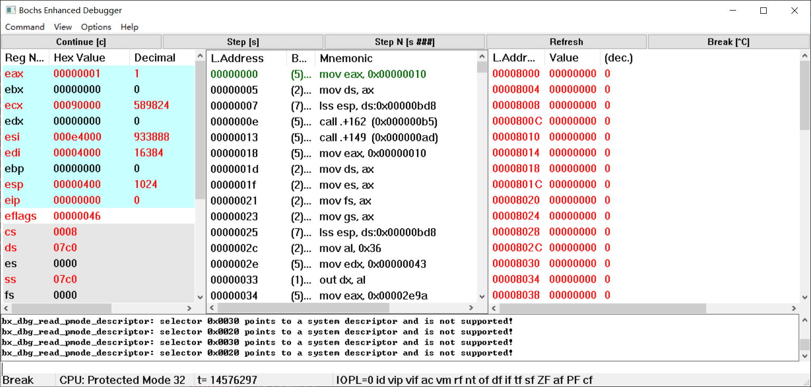
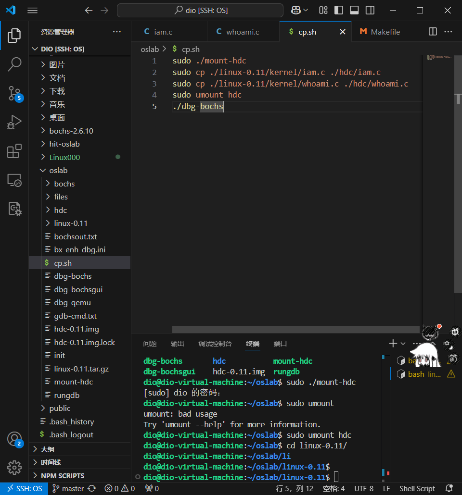
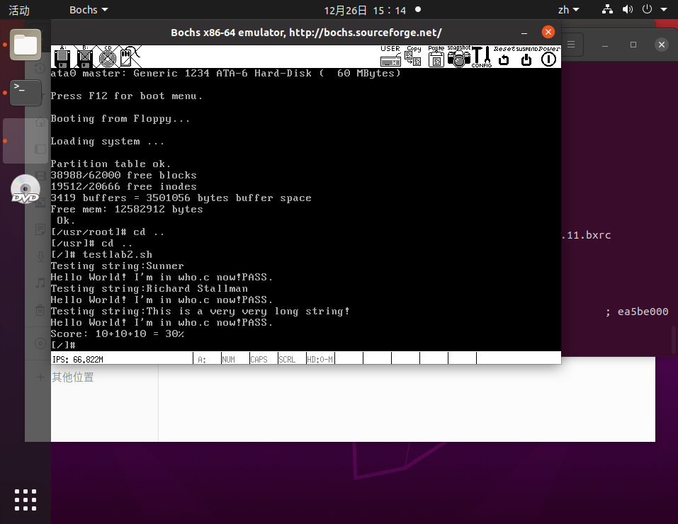

实验记录：实验的核心过程说明、效果截图、每个实验中规定的问题

# 实验一：调试分析 Linux0.00 引导程序

## 1.1 实验目的
- 熟悉实验环境
- 掌握如何手写Bochs虚拟机的配置文件
- 掌握Bochs虚拟机的调试技巧
- 掌握操作系统启动的步骤

## 1.2 实验内容
### 1.2.1 掌握如何手写Bochs虚拟机的配置文件
#### 简介 Bochs 虚拟机的配置文件
```bxrc
# 根据Bochs虚拟机的配置文件格式，想启动bochs虚拟机，常规必填配置如下：
- megs: 设置模拟内存大小。
- romimage: 指定BIOS ROM镜像文件的位置。
- vgaromimage: 指定VGA BIOS ROM镜像文件的位置。
- boot: 定义启动方式，如从磁盘(disk)、软驱(floppya)启动。
- ata0-master: 配置主ATA设备，通常用于指定硬盘镜像文件。
- floppya: 如果计划使用软驱作为启动介质，则需指定软盘镜像文件。
- display_library: 选择显示库，比如x（X Window）、win32（Windows原生）、sdl（跨平台SDL库）等。
- log: 指定调试和杂项信息的日志文件位置。
```
一份配置文件示例如下：
```
romimage: file=BIOS-bochs-latest
 
vgaromimage: file=VGABIOS-lgpl-latest
 
megs: 32
 
boot: floppy
 
floppya: 1_44=floppy.img, status=inserted
 
boot: disk
 
ata0: enabled=1, ioaddr1=0x1f0, ioaddr2=0x3f0, irq=14, type=disk, path=harddisk.img, cylinders=1024, heads=16, spt=63
 
log: bochsout.txt

config_interface: win32config

display_library: win32, options="gui_debug"

```
#### 如何设置从软驱启动
配置文件中配置boot参数为```boot: floppy```，并指定软驱镜像文件。
#### 如何设置从硬盘启动
配置文件中配置boot参数为```boot: disk```，并指定硬盘镜像文件。
#### 如何设置调试选项
配置文件中添加debug参数，详细内容如下：
```
# 启用调试输出
debug: action="option_name", parameter="value"
 
# 例如，设置调试动作为打印所有调试信息
debug: action="debug", option="all"
 
# 可以设置其他选项，例如设置断点
debug: action="bpoint", name="my_breakpoint", type=address, addr=0x1234
```
### 1.2.2 掌握Bochs虚拟机的调试技巧
#### 如何单步跟踪？
输入```s```即可单步执行指令，或者点击Step[s]按钮。

#### 如何设置断点进行调试？
使用```b <address>```指令设置断点,\<address>为要设置断点的内存地址或符号
使用```info break```指令可以查看全部的断点。

删除断点可以使用```bc <断点号>```指令
#### 如何查看通用寄存器的值？
在调试界面最左的寄存器窗口可以查看通用寄存器的值。

#### 如何查看系统寄存器的值？
在调试界面最左的寄存器窗口下面可以查看系统寄存器的值。

#### 如何查看内存指定位置的值？
使用```x /<count><format> <address>```命令来查看内存中特定位置的值。命令的基本语法如下：
\<count>：指定要查看的数据项数量。
\<format>：指定数据的显示格式，如 b(字节)、w(字)、d(双字)等。
\<address>：指定要查看的内存地址。
例如，要查看内存地址0x1234处的双字(32位数据)的内容
```x /1wd 0x1234```
#### 如何查看各种表，如 gdt ，idt ，ldt 等？
点击导航栏的view可以选择要查看的表
也可以使用```info <table_name>```命令来查看表。

#### 如何查看 TSS？
使用```info tss```命令来查看TSS。
#### 如何查看栈中的内容？
使用```info stack```命令来查看栈。
#### 如何在内存指定地方进行反汇编？
使用```disasm <address> <count>```指令在内存指定地址进行反汇编，address是地址，count是要反汇编的指令数
### 1.2.3 计算机引导程序
#### 如何查看 0x7c00 处被装载了什么？
使用```x /<count><format> 0x7c00```指令
#### 如何把真正的内核程序从硬盘或软驱装载到自己想要放的地方？
编写引导加载程序，利用引导启动程序boot.s, boot.s 主要功能就是将软盘或映像文件中的 head 内核diamagnetic加载到内存中某个指定位置处，并在设置临时 GDT 表等信息后，把处理器设置成运行在保护模式下，然后跳转到hed 代码处去运行代码。
实际上，boot.s 程序会首先利用 ROM BIOS 中断 int 0x13 把软盘中的 head 代码读入到内存0x10000 位置开始处，然后再把这段 head 代码移动到内存 0 处，最后设置控制寄存器CR0 中的开启保护运行模式，并跳转到内存 0 处开始执行 head 代码。
#### 如何查看实模式的中断程序？
1. 查找中断向量表  
在实模式下，中断处理程序通常通过中断向量表来查找。这个表包含中断号与中断处理程序的关联关系。
2. 查看中断处理程序  
一旦找到了中断处理程序的地址，就可以利用x addr指令即可查看对应地址的内存内容，即中断程序的内容。
#### 如何静态创建 gdt 与 idt ？
1. 创建 GDT 和 IDT 表项：定义 GDT 和 IDT 表项的结构。每个表项包含段描述符或中断描述符的相关信息，例如段基址、段限制、访问权限等。根据需要，创建所有所需的表项。

2. 初始化 GDT 和 IDT 表项：为每个表项设置适当的值，包括段的起始地址、限制、特权级别、类型（代码段、数据段、中断门等）等。

3. 创建 GDT 和 IDT 表：将所有初始化的表项组合成 GDT 和 IDT 表，这些表通常存储在内存中。

4. 加载 GDT 和 IDT：使用汇编代码将 GDT 和 IDT 表的地址加载到处理器的 GDTR 和 IDTR 寄存器中。这通常涉及到汇编指令 lgdt（加载 GDT）和 lidt（加载 IDT）。

5. 启用中断：如果正在设置 IDT 以处理中断，确保启用中断处理器，以便它可以响应中断。这可以通过设置处理器的中断标志位（IF）来完成。

6. 编写中断处理程序：如果设置了 IDT 来处理中断，需要编写相应的中断处理程序。

7. 汇编和链接：将所有汇编代码和数据结构汇编并链接成可执行文件。这个文件将包含 GDT 和 IDT 表的初始化和加载代码，以及任何必要的中断处理程序。

8. 加载到目标系统：将生成的可执行文件加载到目标系统的内存中，并执行以初始化 GDT 和 IDT 表。
#### 如何从实模式切换到保护模式？
1. 准备 GDT 和 IDT：在保护模式下，需要配置全局描述符表（GDT）和中断描述符表（IDT）。需要创建和初始化这些表，包括定义段描述符和中断门。

2. 加载 GDT 和 IDT：使用 lgdt 汇编指令加载 GDT 表的地址到 GDTR 寄存器，并使用 lidt 指令加载 IDT 表的地址到 IDTR 寄存器。

3. 设置 CR0 寄存器：将控制寄存器 CR0 的第0位（PE位）设置为1，以启用保护模式。这可以通过执行汇编指令 mov eax, cr0，or eax, 1，mov cr0, eax 来完成。

4. 跳转到新代码段：在切换到保护模式后，执行 far jump 指令以跳转到新的代码段。通常，会跳转到新的代码段以开始执行保护模式下的代码。

5. 设置栈指针：在保护模式下，通常需要重新设置栈指针（SP）以指向新的栈段。这是因为在实模式下，栈通常在段0x0000下，而在保护模式下通常会有不同的栈段。

6. 编写保护模式代码：一旦切换到保护模式，需要编写适用于该模式的代码。
#### 调试跟踪 jmpi 0,8 ，解释如何寻址？
jmpi指令位于Linux0.00的boot.s源码中，程序格式为```jmpi <offset> <segment>```
该指令会在bochs运行win32虚拟机时被翻译成```jmpf <segment> <offset>```
根据boot.s源码，boot.s程序入口位于BOOTSEG = 0x07c0，由于实模式下的每个段代表16字节的偏移,所以最终物理地址为0x7c00。
在0x7c00 处设置断点，continue运行

找到jmpf 0x0008,0000 地址在0x7c4c，在此处设置断点，继续运行

单步运行后，跳转到0x0000，寻址逻辑为：在GDT表中第二个选择子，即0x0008处偏移0字节，查阅GDT表，段选择子的第二个选择子基地址为0x0，偏移0之后就是0x00000000


程序跳转到0x0000处
jmpi 0,8 同理

## 1.3 实验报告
完成以下任务：
程序运行后运行结果如下：

#### 请简述 head.s 的工作原理
通常情况下，head.s 是引导加载程序（bootloader）的一部分，用于引导加载操作系统内核，包含 32 位保护模式初始化设置代码、时钟中断代码、系统调用中断代码和两个任务的代码。
加载到内存：head.s 是一个汇编源代码文件，经过汇编和链接后，生成二进制可执行文件，通常是一个引导扇区（boot sector）。该文件必须存储在引导设备（如硬盘或软驱）的引导扇区中。
引导加载程序：计算机启动时，处理器会加载引导设备的引导扇区（通常位于磁盘的第一个扇区）到内存地址0x7C00。这个扇区通常包含了 head.s 的代码。
设置环境：head.s 开始执行，它的主要任务是设置一个适当的环境，以准备加载操作系统内核。这通常涉及到以下几个步骤：
- 初始化 GDT/IDT
- 设置系统定时器芯片 8253
- 初始化 TSS
- 跳转到task0 的用户态程序
- task0 或 task1 的用户态程序在运行时，通过系统调用 int 0x80 向屏幕上打印字符A 或B
- 时钟中断发生时，内核的中断处理程序实现task0 和task1 的任务切换

#### 请记录 head.s 的内存分布状况，写明每个数据段，代码段，栈段的起始与终止的内存地址
1. 栈段
起始地址：0x00008000
终止地址：0x000080c4+4-1，即0x000080c7


2. 数据段、代码段
代码段（text segment）：引导加载程序的机器代码，通常位于内存的低地址
数据段（data segment）：引导加载程序的数据和全局变量，可能位于代码段的下方
点击GDT查看全局描述符表 (GDT) 的内容

Selector 0x0008 通常用于访问操作系统内核的代码段
Selector 0x0010 通常用于访问操作系统内核的数据段
根据上图我们可以看到数据段和代码段的起始地址都是0x0，Size均为0x7FFFFF，终止地址=起始地址+Size，由此可得**数据段和代码段**的
**起始地址**为：0x0
**终止地址**为：0x7FFFFF
#### 简述 head.s 57 至 62 行在做什么？
head.s的56-62代码为：

在第56行 sti 设置断点

对下面六条指令进行反汇编


init_stack中内容为：设置堆栈指针（SS:ESP）的初始值，以确保堆栈能够正常工作

任务0的LDT为：

整体指令作用：
```sti```指令用于开启中断，允许处理器响应中断请求。
```pushl $0x17```将任务 0 的当前局部数据段选择符入栈。这个选择符是用于任务 0 的堆栈段。
```pushl $init_stack```将 init_stack 的地址入栈。这是为了保存任务 0 的堆栈指针。
```pushfl```指令将标志寄存器的值入栈。这个值包括处理器状态标志，如进位标志、溢出标志等。
```pushl $0x0f```将当前局部代码段选择符入栈。这个选择符通常用于指定任务 0 的代码段。
```pushl $task0```将任务 0 的入口地址入栈。这是为了保存任务 0 的执行位置。
```iret```是中断返回指令，它会从栈中弹出保存的信息，包括代码指针、代码段选择符、标志寄存器值等，并使用这些信息切换到任务 0 的执行上下文。这实现了从中断处理程序返回到任务 0 的操作。
#### 简述 iret 执行后， pc 如何找到下一条指令？
iret 指令用于从中断处理程序返回到正常的程序执行。iret 指令的执行后，处理器会进行下一跳指令的查找和执行，下面是其执行后寻找下一跳指令的过程：
1. iret 恢复寄存器状态：iret 指令会从栈中弹出一系列值，包括代码段选择符（CS）、代码指针（EIP）、标志寄存器（EFLAGS），以及堆栈指针（ESP）的值。这些值都是在中断处理过程中被保存的，用于恢复中断前的状态。
2. 加载代码段选择符（CS）：iret 指令将代码段选择符（CS）从栈中加载到 CS 寄存器中。CS 寄存器包含了新的代码段选择符，它指示了中断返回后应执行的代码段。
3. 加载代码指针（EIP）：iret 指令将代码指针（EIP）从栈中加载到 EIP 寄存器中。EIP 寄存器包含了下一条要执行的指令的地址。
4. 加载标志寄存器（EFLAGS）：iret 指令将标志寄存器（EFLAGS）从栈中加载到 EFLAGS 寄存器中。这些标志用于控制处理器的状态和行为。
5. 堆栈指针（ESP）的修改：iret 指令还会从栈中弹出堆栈指针（ESP）的值。这是为了确保栈指针正确地指向下一个栈帧。
6. 执行下一跳指令：一旦 iret 执行完上述步骤，控制将传递到新的代码段（由 CS 指定）中的新指令（由 EIP 指定）。处理器将从新代码段的新指令地址开始执行，从而继续程序的正常执行，即继续执行任务0的程序
#### 记录 iret 执行前后，栈是如何变化的？
执行前

单步执行后

#### 当任务进行系统调用时，即 int 0x80 时，记录栈的变化情况。
执行前

执行后


# 实验二：调试分析Linux 0.00 多任务切换
## 2.1 实验目的
- 通过调试一个简单的多任务内核实例，使大家可以熟练的掌握调试系统内核的方法；

- 掌握Bochs虚拟机的调试技巧；

- 通过调试和记录，理解操作系统及应用程序在内存中是如何进行分配与管理的；

## 2.2 实验内容
通过调试一个简单的多任务内核实例，使大家可以熟练的掌握调试系统内核的方法。 这个内核示例中包含两个特权级 **3** 的用户任务和一个系统调用中断过程。我们首先说明这个简单内核的基本结构和加载运行的基本原理，然后描述它是如何被加载进机器 **RAM** 内存中以及两个任务是如何进行切换运行的。
### 2.2.1 掌握Bochs虚拟机的调试技巧
同 1.2.2 节
## 2.3 实验报告
#### 当执行完 system_interrupt 函数，执行 153 行 iret 时，记录栈的变化情况。
system_interrupt 函数内容如下：

iret 用于中断返回，从栈中恢复标志寄存器、堆栈指针、代码段选择符、代码指针等，然后从新代码段中执行下一条指令。
在0x17c处设置断点，此时stack内容如下：

单步执行后，观察到esp、eip、eflags、cs、ss发生了变化

#### 当进入和退出 system_interrupt 时，都发生了模式切换，请总结模式切换时，特权级是如何改变的？栈切换吗？如何进行切换的？
- 特权级
在进入和退出 system_interrupt 时发生了特权级的模式切换。
    1. **进入 system_interrupt**：
用户态（特权级 3）切换到内核态（特权级 0），中断服务在内核态中执行。
处理器将特权级从 3 切换到 0，CS的值由 0xf 变为 0x8。
    2. **退出 system_interrupt**：
内核态（特权级 0）切换回用户态（特权级 3）。
iret执行之后，处理器将特权级从 0 切换到 3，CS的值由 0x8 变为 0xf。
- 栈
在进入和退出 system_interrupt 时同时会发生栈的切换。
    1. **进入 system_interrupt** ：
发生堆栈切换，以便在内核态中使用内核堆栈，来保护用户堆栈的完整性。
    2. **退出 system_interrupt**：
发生堆栈切换，以返回到原特权级的堆栈，并继续用户态的执行。
- 如何切换
这种特权级的切换和堆栈切换是**操作系统内核**和**处理器硬件**协同工作的结果。
    1. **保存当前上下文**：在模式切换之前，当前执行的任务的上下文以及当前特权级需要被保存压入栈中
    2. **选择新特权级别**：根据要切换到的特权级别，操作系统选择新的代码段描述符和堆栈描述符，**切换堆栈和特权级**，并将它们加载到相应的寄存器中。
        1. 在进入内核态时，通常会使用内核堆栈，以避免破坏用户堆栈。
        2. 在退出内核态时，特权级和堆栈状态会恢复，以确保程序的正常执行。
#### 当时钟中断发生，进入到 timer_interrupt 程序，请详细记录从任务 0 切换到任务 1 的过程。
timer_interrupt 函数内容如下：

任务0和任务1分别是打印A和打印B

在0x12c处设置断点，运行程序，可以观察到已经输出了一排A

单步执行，直到eip为0x149，此时准备执行jmpf 0x30:0,将一个 TSS 选择子（0x30）装入 CS，实际上就是为了将任务切换到这个 TSS。而0x30是task1的TSS

输入info tss记录内容

单步执行，此时跳转到了0x10f4，此时已切换到任务1入口

查看tss，tss变化为task1的tss

#### 又过了 10ms ，从任务1切换回到任务 0 ，整个流程是怎样的？ TSS 是如何变化的？各个寄存器的值是如何变化的？
在0x15c处设断点，然后运行程序，可以看到程序输出了一些B，说明执行了task1

此时tss

然后单步执行 当前指令为jmpf 0x20:0，即将一个tss选择子(0x20)装入cs，也就是task0的tss。

#### 请详细总结任务切换的过程。
1. 时钟中断触发：任务切换通常是由系统中的时钟中断timer_interrupt 触发的。时钟中断以固定的时间间隔（每10毫秒）发生一次，它是多任务处理的触发点。

2. 保存当前任务上下文：当时钟中断触发时，操作系统会执行时钟中断处理程序。在处理程序执行之前，当前正在执行的 taskA 的上下文会被保存。EAX、ECX、EDX、EFLAGS、ESP、CS、EIP等寄存器的状态会保存在 taskA 的 TSS 中。

3. 选择下一个任务：在时钟中断处理程序中，操作系统会选择下一个要执行的 taskB ，任务B的上下文信息存储在 taskB 的TSS中。

4. 加载下一个任务上下文：时钟中断处理程序通过 taskB 的 TSS 将 taskB 的上下文信息（寄存器的值）加载到处理器中，处理器现在准备执行 taskB 。

5. 切换堆栈：如果 taskA 和 taskB 使用不同的内核堆栈，堆栈指针寄存器ESP将从 taskA 的内核堆栈切换到 taskB 的内核堆栈，以确保 taskB 可以正常执行内核代码。

6. 特权级别切换：如果 taskA 和 taskB 属于不同的特权级别，时钟中断处理程序会执行特权级别切换操作。

7. taskB 开始执行： taskB 的上下文准备就绪并加载到处理器中， taskB 开始执行。

8. 时钟中断返回：时钟中断处理程序执行完毕后，处理器返回到 taskB 的执行点， taskB 继续执行。

在这个过程中，TSS寄存器中的值将发生变化，以反映新任务的上下文。旧任务的上下文信息已经被保存，以便在未来的任务切换中恢复。其他寄存器的值也会根据任务上下文的不同而变化，以确保任务切换的正确执行。这个过程允许多个任务在同一个系统中轮流执行，实现多任务处理。

# 实验三：操作系统的引导
## 3.1 实验目的
- 熟悉实验环境；

- 建立对操作系统引导过程的深入认识；

- 掌握操作系统的基本开发过程；

- 能对操作系统代码进行简单的控制，揭开操作系统的神秘面纱。

## 3.2 实验内容
- 按照下面的要求改写 Linux 0.11 的引导程序 bootsect.s ;
### 3.2.1 改写 bootsect.s 主要完成如下功能：
>bootsect.s 能在屏幕上打印一段提示信息
**XXX is booting...**
其中 XXX 是你给自己的操作系统起的名字，也可以显示一个特色 logo ，以表示自己操作系统的与众不同。

阅读bootsect.s源码，该部分是打印提示信息的代码

该部分是要打印的信息，将其修改为“The World OS is booting...”

启动引导程序，成功输出


### 3.2.2 改写 setup.s 主要完成如下功能：
bootsect.s 能完成 setup.s 的载入，并跳转到 setup.s 开始地址执行。而 setup.s 向屏幕输出一行

**Now we are in SETUP**
setup.s 能获取至少一个基本的硬件参数（如内存参数、显卡参数、硬盘参数等）， 将其存放在内存的特定地址，并输出到屏幕上。

setup.s 不再加载Linux内核，保持上述信息显示在屏幕上即可。
阅读setup.s源码，补充start内容，用bootsect.s中的代码填充

补充打印信息代码，打印后陷入循环，停止加载内核

编译后运行，成功显示两行信息

## 3.3 实验报告
在实验报告中回答如下问题：
### 有时，继承传统意味着别手蹩脚。 x86 计算机为了向下兼容，导致启动过程比较复杂。 请找出 x86 计算机启动过程中，被硬件强制，软件必须遵守的两个“多此一举”的步骤（多找几个也无妨），说说它们为什么多此一举，并设计更简洁的替代方案。
#### **硬件设备初始化的顺序化**
BIOS 启动时硬件初始化通常是串行的，按顺序逐个初始化设备。这种方式导致启动时间较长。
现代硬件具有并行能力，但传统 BIOS 并未充分利用。
**替代方案**
UEFI 已改进这一点，硬件初始化可以部分并行化，显著缩短启动时间。
更高级的操作系统启动程序（如 Linux 的 initramfs）可以直接处理硬件初始化任务，减少固件层的工作。

#### 实模式（Real Mode）的使用
x86 CPU 在上电或复位后，默认进入实模式，这是 8086 处理器的运行模式，仅支持 20 位地址总线（1 MB 地址空间）和简单的 16 位寄存器操作。
现代 x86 处理器实际上支持 32 位甚至 64 位寻址（保护模式和长模式），但仍需要从实模式启动，然后切换到更高的模式。
这种设计是为了兼容早期的 BIOS 和 16 位软件，显得极为低效。
**替代方案**
直接进入长模式（Long Mode）启动：处理器上电后直接进入 64 位模式，无需经过实模式和保护模式的中间阶段。这样可以利用更大的地址空间和更高效的指令集。
UEFI 替代 BIOS：现代 UEFI 固件已经实现了这一点，放弃了传统 BIOS 的 16 位调用模式，直接以 64 位模式启动并加载操作系统。

# 实验四：系统调用
## 4.1 实验目的
- 建立对系统调用接口的深入认识

- 掌握系统调用的基本过程

- 能完成系统调用的全面控制

- 为后续实验做准备

## 4.2 实验内容
此次实验的基本内容是：在 Linux 0.11 上添加两个系统调用，并编写两个简单的应用程序测试它们。

### 4.2.1 iam()
第一个系统调用是 iam() ，其原型为：
```
int iam(const char * name);
```
完成的功能是将字符串参数 name 的内容拷贝到内核中保存下来。 要求 name 的长度不能超过 23 个字符。返回值是拷贝的字符数。 如果 name 的字符个数超过了 23 ，则返回 -1 ，并置 errno 为 EINVAL 。

在 kernal/who.c 中实现此系统调用。
#### 实现
在Linux0.11的include中找到unistd.h头文件并添加要定义的宏
==注意==此时不是修改内核目录里的，而是修改在 v0.11 的开发环境里的这个文件。
先挂载linux-v0.11的磁盘，并在include/unistd.h 中添加宏
```
cd oslab
sudo ./mount-hdc
cd hdc/usr/include
gedit unistd.h
```


修改 kernel/system_call.s 文件中的系统调用总数，从72修改为74


在 include/linux/sys.h 文件中增加 whoami() 和 iam() 两个函数声明，添加顺序要和定义的宏的顺序一致


最后编写函数数显 sys_iam() 和 sys_whoami()，在kernel/who.c 中实现
可以仿照其他用户和系统调用的方式


程序实现后改写Makefile文件，使得后续可以使用make all全部编译


最后编写测试程序调用上述编写的函数
iam.c

whoami.c

编写脚本将两个测试函数移动到 linux-v0.11 系统下
cp.sh脚本如下：

运行后进入 linux-v0.11 系统下，移动到根目录，可以看到iam.c和whoami.c测试文件，进行编译后成功输出"Hello World! I'm in who.c now!"这一定义在iam中```printk```的内容。

### 4.2.2 whoami()
第二个系统调用是 whoami() ，其原型为：
```
int whoami(char* name, unsigned int size);
```
它将内核中由 iam() 保存的名字拷贝到 name 指向的用户地址空间中， 同时确保不会对 name 越界访存（ name 的大小由 size 说明）。 返回值是拷贝的字符数。如果 size 小于需要的空间，则返回 -1 ，并置 errno 为 EINVAL 。

也是在 kernal/who.c 中实现。
**该部分内容见上一部分**
### 4.2.3 测试程序
运行添加过新系统调用的 Linux 0.11 ，在其环境下编写两个测试程序 iam.c 和 whoami.c 。最终的运行结果是：
```
./iam guojunos
./whoami
guojunos
```
目标截图：

运行结果：

## 4.3 实验报告
在实验报告中回答如下问题：
运行testlab2.c，过程如下：
修改cp.sh脚本，将testlab2.c及testlab2.sh复制到linux-0.11中

执行程序，看到测试程序出现在同一目录下

编译并执行testlab2，得分如下：

执行testlab2.sh，得分如下：

### 从 Linux 0.11 现在的机制看，它的系统调用最多能传递几个参数？
由定义在unistd.h中的syscal3可以看出，当前系统调用最多能传递3个参数

### 你能想出办法来扩大这个限制吗？
可以考虑将几个参数打包成一个结构体，然后通过一个寄存器传递结构体地址，间接访问参数。
### 用文字简要描述向 Linux 0.11 添加一个系统调用 foo() 的步骤。
1. 挂载hdc后include/unistd.h中添加系统调用号
2. 在kernel/system_call.s修改总调用数（+1）
3. 在include/linux/sys.h添加函数声明extern int sys_foo();
4. 在kernel/foo.c中创建函数实现
5. 修改kernel/Makefile，添加编译规则
6. make all重新编译系统，使用gcc编译用户态程序进行测试

# 实验五：进程运行轨迹的跟踪与统计
## 5.1 实验目的
- 掌握 Linux 下的多进程编程技术；

- 通过对进程运行轨迹的跟踪来形象化进程的概念；

- 在进程运行轨迹跟踪的基础上进行相应的数据统计，从而能对进程调度算法进行实际的量化评价， 更进一步加深对调度和调度算法的理解，获得能在实际操作系统上对调度算法进行实验数据对比的直接经验。

## 5.2 实验内容
进程从创建（ Linux 下调用 fork() ）到结束的整个过程就是进程的生命期， 进程在其生命期中的运行轨迹实际上就表现为进程状态的多次切换，如进程创建以后会成为就绪态； 当该进程被调度以后会切换到运行态；在运行的过程中如果启动了一个文件读写操作， 操作系统会将该进程切换到阻塞态（等待态）从而让出 CPU ； 当文件读写完毕以后，操作系统会在将其切换成就绪态，等待进程调度算法来调度该进程执行……

本次实验包括如下内容：

### 基于模板 process.c 编写多进程的样本程序，实现如下功能：

所有子进程都并行运行，每个子进程的实际运行时间一般不超过 30 秒；

父进程向标准输出打印所有子进程的 id ，并在所有子进程都退出后才退出；

### 在 Linux 0.11 上实现进程运行轨迹的跟踪。基本任务是在内核中维护一个日志文件 /var/process.log ，把从操作系统启动到系统关机过程中所有进程的运行轨迹都记录在这一 log 文件中。

### 在修改过的 0.11 上运行样本程序，通过分析 log 文件，统计该程序建立的所有进程的等待时间、完成时间（周转时间）和运行时间，然后计算平均等待时间，平均完成时间和吞吐量。可以自己编写统计程序，也可以使用 python 脚本程序 stat_log.py 进行统计。

### 修改 0.11 进程调度的时间片，然后再运行同样的样本程序，统计同样的时间数据，和原有的情况对比，体会不同时间片带来的差异。

/var/process.log 文件的格式必须为：

```pid X time```
其中：

pid 是进程的 ID ；

X 可以是 N , J , R , W 和 E 中的任意一个，分别表示进程新建( N )、进入就绪态( J )、进入运行态( R )、进入阻塞态( W )和退出( E )；

time 表示 X 发生的时间。这个时间不是物理时间，而是系统的滴答时间( tick )；

三个字段之间用制表符分隔。 例如：
```
12    N    1056
12    J    1057
4     W    1057
12    R    1057
13    N    1058
13    J    1059
14    N    1059
14    J    1060
15    N    1060
15    J    1061
12    W    1061
15    R    1061
15    J    1076
14    R    1076
14    E    1076
……
```


修改时间片
在/include/linux/sched.h中修改

先测试默认为15时

修改为10时

最后测试为5时

可以发现伴随时间片的增大，吞吐率先升高后降低，在本机运行时，时间片为5时吞吐率最大。
## 5.3 实验报告
完成实验后，在实验报告中回答如下问题：

### 结合自己的体会，谈谈从程序设计者的角度看，单进程编程和多进程编程最大的区别是什么？
单进程程序是按编写顺序依次执行的，在IO量较大的情况下效率低。
多进程程序是同时执行多个进程，在IO量较大的情况下效率较高。
### 你是如何修改时间片的？仅针对样本程序建立的进程，在修改时间片前后， log 文件的统计结果（不包括Graphic）都是什么样？结合你的修改分析一下为什么会这样变化，或者为什么没变化？
时间片通过Linux-0.11/include/linux/sched.h文件进行修改：

在INIT_TASK中修改第一行的最后一个值，默认时间片为15，本实验中依次修改为15-10-5
发生变化的主要原因：
时间片小，进程因中断或者睡眠进入的进程调度次数少，而因时间片到时而产生的进程调度变多。
时间片大，进程因中断或者睡眠进入的进程调度次数多，因时间片到时而产生的进程调度变少。
